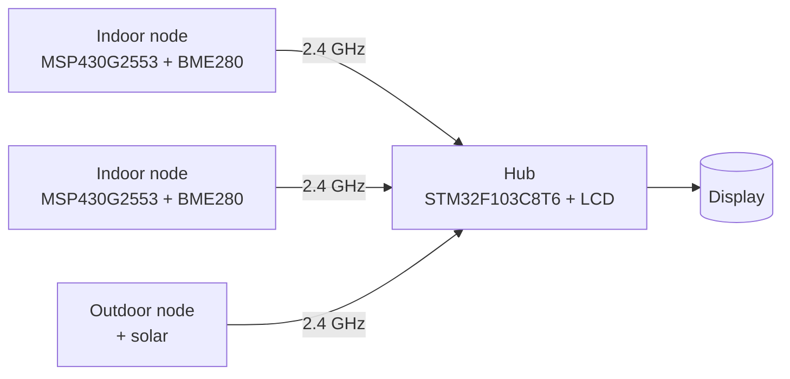

# Psychrometer

A family of miniature, ultra-low-power autonomous temperature, humidity and
pressure sensors that report periodically to a single hub over a 2.4 GHz
nRF24L01+ star network.

**Version:** 0.1.0 | **Status:** concept

---

## Overview

Each sensor node samples a BME280 (temperature / humidity / pressure), transmits
the reading to the hub, and returns to deep sleep. The MCU spends almost all of
its life in low-power mode, waking once every transmit period. Battery life is
measured in years; an outdoor variant runs from a small solar panel.

The hub collects readings from every node and displays them on an LCD.

---

## Hardware

| Role | Part | Notes |
|---|---|---|
| Node MCU | TI MSP430G2553 | 16 KB Flash, 512 B RAM, ~0.1 uA LPM3/4 |
| Sensor | Bosch BME280 | T / H / pressure, ~0.1 uA sleep, I2C |
| Radio | nRF24L01+ (GT-24-Mini) | 2.4 GHz, SPI, 3.3 V supply and logic |
| Node power | CR2032 / 2xAA Li | battery |
| Outdoor power | 5.28 V / 0.37 W solar + LiFePO4/supercap | self-sustaining |
| Hub MCU | STM32F103C8T6 | 64 KB Flash, 20 KB RAM, + LCD |
| Hub radio | nRF24L01+ | same RF, PRX role |

---

## Network

- Topology: **star** - up to **20** nodes, ~10 planned plus expansion.
- Range: single apartment / small house.
- Transmit period: **10 minutes** default (indoor and outdoor).
- Reliability: nRF24L01+ auto-ACK with retransmit; each node has a unique
  pipe address.

---

## Repository layout

| Path | Purpose |
|---|---|
| `inc/` | Public headers |
| `src/` | Common application sources |
| `docs/` | Doxygen config and diagrams |
| `requirements.md` | Requirements and task backlog |
| `HISTORY.md` | Milestone log |
| `CHANGELOG.md` | Versioned change log |

---

## License

See [LICENSE](LICENSE).
